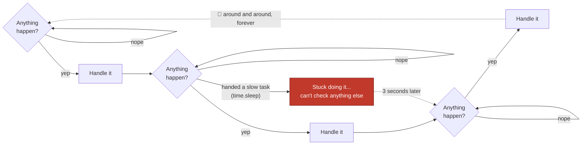
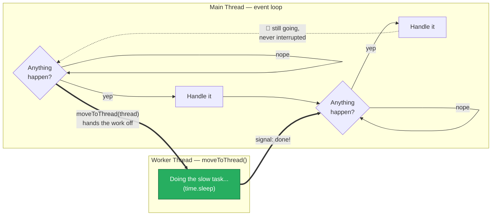

# Qt Threading Tutorial

This project has three small apps that all do the exact same thing — click a
button, wait 3 seconds, show a message — but each one handles that 3-second
wait differently. Comparing them is the best way to understand *why* threads
matter. Before you run them, here's the vocabulary you'll need.

## What is an Event Loop?

Imagine a little robot whose entire job is to run one loop, forever:
*"Did anything happen? Was a button pressed? Did a timer go off? Does the
screen need to be redrawn?"* When the answer is yes, the robot handles it,
then immediately goes back to asking the question again. Around and around,
forever, many times a second.

That robot is exactly what a GUI app runs — it's called the **event loop**.
Every button click, every mouse move, every screen update happens because
the event loop noticed it and reacted.



That's the robot doing its job normally — check, handle, check, handle,
around and around forever, so fast it feels instant. The red box is what
happens the moment it gets handed something like `time.sleep(3)` directly
mid-loop: it walks into that task and doesn't come back out until it's
done, so nothing else — not clicks, not the ticking counter, nothing —
gets checked the whole time it's stuck.

The catch: if you hand the robot a task that takes 3 minutes (like sorting a
giant pile of papers) *while it's supposed to be looping*, it gets stuck
doing that one task and stops checking for anything else. It looks "frozen."
That's precisely what happens in
[1_freezing_app.py](1_freezing_app.py): the button's click handler calls
`slow_task()` directly, which does `time.sleep(3)`. That code runs *on the
event loop itself*, so the loop can't check for anything else — not even the
`QTimer` that's supposed to tick every 100ms (see [1_freezing_app.py:64-67](1_freezing_app.py#L64-L67)).
Run it and watch the whole window lock up for 3 full seconds.

## What is a Thread?

A **thread** is a separate stream of instructions your program can run at
the same time as everything else — like giving that giant pile of papers to
a *second* robot to sort in another room, while the first robot keeps
looping and checking for clicks without interruption.



Same slow task as before, but now it's off in its own lane. The main
thread's loop never has to walk into it — it just hands the work over once
with `moveToThread()` and keeps right on looping, checking clicks and
ticking the counter the entire time. When the worker finishes, it doesn't
interrupt the loop either — it just sends a **signal** (more on that next),
which the loop picks up on its next lap, same as any other event.

In [2_subclass_qthread_app.py](2_subclass_qthread_app.py), the slow work
(`time.sleep(3)`) happens inside `run()` on a `QThread` subclass (see
[2_subclass_qthread_app.py:44-50](2_subclass_qthread_app.py#L44-L50)), instead
of directly in the button's click handler. The main thread — the one running
the event loop — stays free the whole time, so the tick counter keeps
counting and the window stays responsive. Compare that to
[3_worker_object_app.py](3_worker_object_app.py), which gets the same result
a different way: a plain `ResponderWorker` object is handed off to a thread
with `moveToThread()` (see [3_worker_object_app.py:48-58](3_worker_object_app.py#L48-L58)).
That's considered the more "correct" pattern in real Qt code, because *every*
method on the worker runs on the background thread — not just the one method
you happened to override.

## What is a Signal?

Threads aren't allowed to just walk into each other's rooms and grab things
— that causes bugs (two threads editing the same label text at once, for
example). Instead, Qt uses **signals**: a way for one part of the program to
announce *"hey, something happened!"* without needing to know who, if
anyone, is listening.

Think of it like a walkie-talkie. The worker thread finishes its slow task
and keys the mic: *"Done! Here's the result."* It doesn't know or care who's
listening on the other end — it just broadcasts. In the code, that's
`result_ready = pyqtSignal(str)` declared at the top of `ResponderWorker`
(see [2_subclass_qthread_app.py:37](2_subclass_qthread_app.py#L37)), and the
actual broadcast happens with `self.result_ready.emit(response)` (see
[2_subclass_qthread_app.py:50](2_subclass_qthread_app.py#L50)).

## What is a Slot?

A **slot** is the walkie-talkie on the *receiving* end — an ordinary method
that gets called automatically whenever a signal it's listening to goes off.

In this tutorial, `on_result()` is the slot. It updates the status label and
re-enables the button once the background thread reports back (see
[2_subclass_qthread_app.py:94-96](2_subclass_qthread_app.py#L94-L96)). The
line that connects the walkie-talkies together — telling Qt "when
`result_ready` fires, call `on_result`" — is:

```python
self.worker.result_ready.connect(self.on_result)
```

## Try it yourself

Run each app and watch the "Ticks" counter while you click the button:

```bash
python 1_freezing_app.py         # BAD: counter freezes for 3 seconds
python 2_subclass_qthread_app.py # GOOD: counter keeps going (QThread subclass)
python 3_worker_object_app.py    # GOOD: counter keeps going (worker + moveToThread)
```

All three apps *look* identical. The only difference is what thread the
3-second `sleep()` runs on — which is the whole point of this tutorial.

All of these examples create a new Thread per execution.  This can cause issues if you need to run multiple processes at once.  If you keep the button enabled and click it while your currently running thread is running, your application will fault.  QThreadPool manages a pool of threads and helps resolve these issues.  See [PythonGuis](https://www.pythonguis.com/tutorials/multithreading-pyqt6-applications-qthreadpool/) for a good tutorial on QThreadPool.